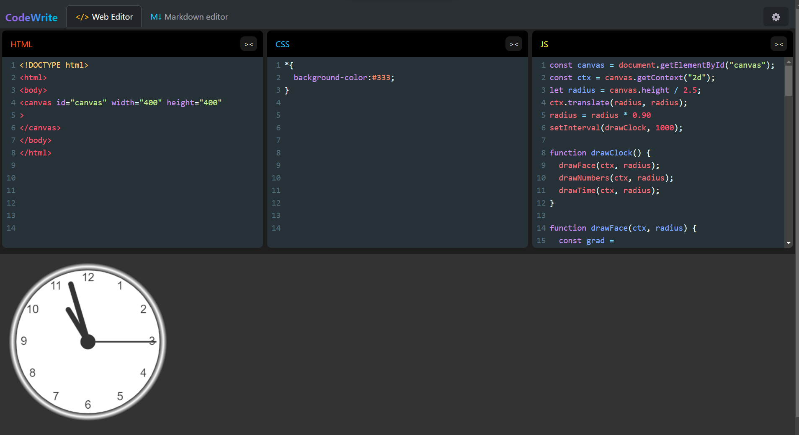
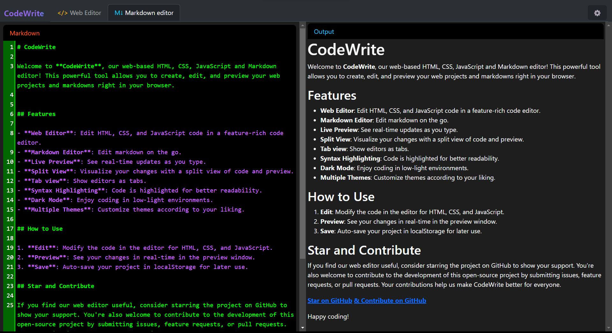
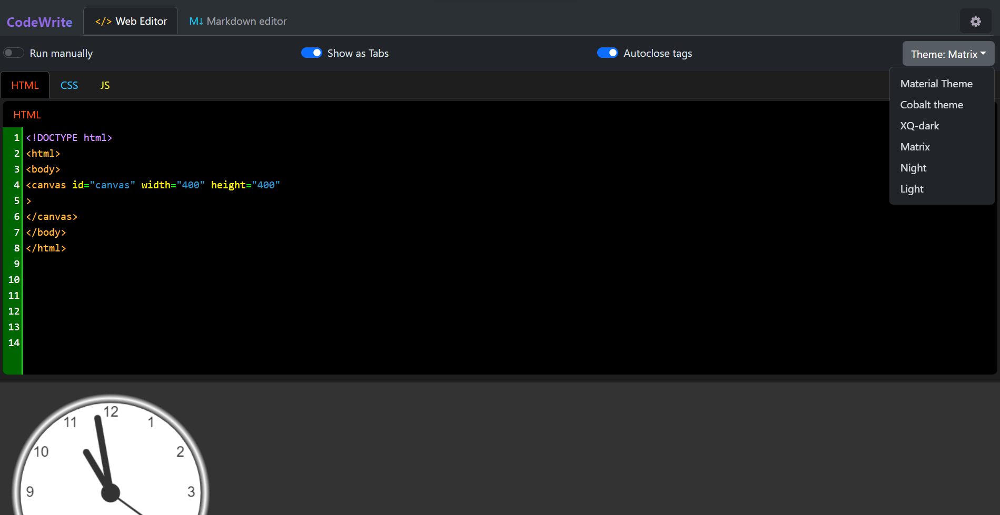

# CodeWrite

Welcome to **CodeWrite**, our web-based HTML, CSS, JavaScript and Markdown editor! This powerful tool allows you to create, edit, and preview your web projects and markdowns right in your browser.

## Features

- **Web Editor**: Edit HTML, CSS, and JavaScript code in a feature-rich code editor.
- **Markdown Editor**: Edit markdown on the go.
  
- **Live Preview**: See real-time updates as you type.
- **Split View**: Visualize your changes with a split view of code and preview.
- **Tab view**: Show editors as tabs.
- **Syntax Highlighting**: Code is highlighted for better readability.
- **Dark Mode**: Enjoy coding in low-light environments.
- **Multiple Themes**: Customize themes according to your liking.
-  **Download** : Download code on your local computer.

## How to Use

1. **Edit**: Modify the code in the editor for HTML, CSS, and JavaScript.
2. **Preview**: See your changes in real-time in the preview window.
3. **Save**: Auto-save your project in localStorage for later use.
4. **Download**: Download your files on computer to test or edit locally.

## Roadmap

- **PWA**: Make the core functionality work offline
- **Backend**: Save code on database
- **Sharing**: Share your code to others to see or fork as link
- **Deployment**: Live preview your website on the server
- **Collaborative** code editing using websockets

## Star and Contribute

If you find our web editor useful, consider starring the project on GitHub to show your support. You're also welcome to contribute to the development of this open-source project by submitting issues, feature requests, or pull requests. Your contributions help us make CodeWrite better for everyone.

[**Star on GitHub**](https://github.com/PrashantGyawali/CodeWrite)
[**& Contribute on GitHub**](https://github.com/PrashantGyawali/CodeWrite)

Happy coding!

